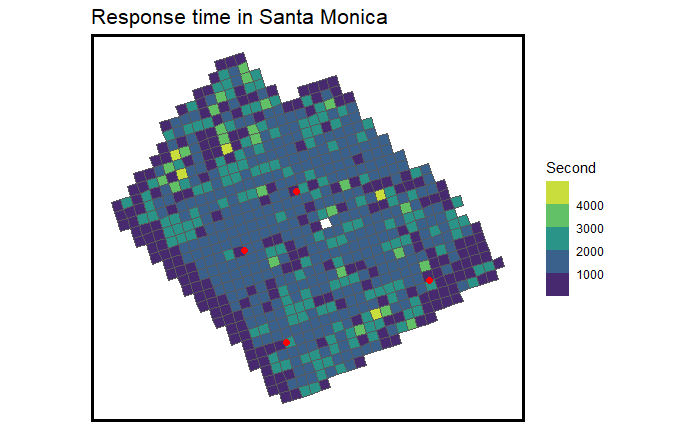

```{r setup, include=FALSE}
knitr::opts_chunk$set(echo = TRUE, results = FALSE, warning=FALSE, message = FALSE, cache = TRUE)
```

# Introduction

Santa Monica has one of the country's most inefficient emergent medical service (EMS) system. The national average time for an ambulance to respond a emergency call is 7 minutes. Even in a rural setting, the average response time is 14 minutes. Santa Monica, however, based on the city data from March to November 2021, takes averagely 30 minutes from receiving the call to arrive the destination, much longer than that of the national average. 

We located the problem to be its ambulance dispatch system. The traditional way to respond an EMS call is to dispatch an ambulance after the station receives a call. The problem is when the nearest station runs out of ambulances, the station needs to request an ambulance from another station further away and adds on to the wait time. 

Thus, we aim to develop the app *beepo* to make ambulance dispatch more efficient in Santa Monica. Our purpose is to manage ambulance vehicles in all four stations citywide, predict when and where the demand of emergency calls rises, and dispatch ambulances to the nearest station when the demand rises.  

```{r library and functions}
library(osmdata)
library(tidyverse)
library(sf)
library(lubridate)
library(tigris)
library(tidycensus)
library(viridis)
library(riem)
library(gridExtra)
library(knitr)
library(kableExtra)
library(RSocrata)
library(gganimate)
library(gifski)
library(caret)
library(RSocrata)
library(FNN)
library(spdep)
library(spatstat)
library(RColorBrewer)
#library(VIM) # check NAs
library(stargazer)


plotTheme <- theme(
  plot.title =element_text(size=12),
  plot.subtitle = element_text(size=8),
  plot.caption = element_text(size = 6),
  axis.text.x = element_text(size = 10, angle = 45, hjust = 1),
  axis.text.y = element_text(size = 10),
  axis.title.y = element_text(size = 10),
  # Set the entire chart region to blank
  panel.background=element_blank(),
  plot.background=element_blank(),
  #panel.border=element_rect(colour="#F0F0F0"),
  # Format the grid
  panel.grid.major=element_line(colour="#D0D0D0",size=.2),
  axis.ticks=element_blank())

mapTheme <- theme(plot.title =element_text(size=12),
                  plot.subtitle = element_text(size=8),
                  plot.caption = element_text(size = 6),
                  axis.line=element_blank(),
                  axis.text.x=element_blank(),
                  axis.text.y=element_blank(),
                  axis.ticks=element_blank(),
                  axis.title.x=element_blank(),
                  axis.title.y=element_blank(),
                  panel.background=element_blank(),
                  panel.border=element_blank(),
                  panel.grid.major=element_line(colour = 'transparent'),
                  panel.grid.minor=element_blank(),
                  legend.direction = "vertical", 
                  legend.position = "right",
                  plot.margin = margin(1, 1, 1, 1, 'cm'),
                  legend.key.height = unit(1, "cm"), legend.key.width = unit(0.2, "cm"))

root.dir = "https://github.com/Bamboo-Forest-Rain/Public-Policy-Analytics-Landing/tree/master/DATA"
source("https://raw.githubusercontent.com/Bamboo-Forest-Rain/Public-Policy-Analytics-Landing/master/functions.r")

palette5 <- c("#eff3ff","#bdd7e7","#6baed6","#3182bd","#08519c")
palette4 <- c("#D2FBD4","#92BCAB","#527D82","#123F5A")
palette2 <- c("#6baed6","#08519c")
```

```{r install_census_API_key, warning = FALSE, include=FALSE, eval = TRUE}
# Install Census API Key
census_api_key("94efffd19b56ad527e379faea1653ee74dc3de4a",overwrite = TRUE, install = TRUE)
```

```{r pressure, result=TRUE,echo=FALSE,fig.cap="Response Time Santa Monica", out.width = '100%'}

```
# Exploratory Analysis 

Our EMS data is filtered from the 911 calls on Santa Monica's open portal. To obtain a unbiased data set, we decided to only analyze the EMS calls from March to November in 2021. This is to eliminate any uncertainty from the pandemic while keeping the data as recent as possible. 

We lubricated the time by hour, day of the week, week, month, and year. We calculated the mean response time from the data set: 29.8 minutes.

```{r read}
# read GeoJson. query the data of EMS only and between March 2021 and November 2021
# use SoQL in https://dev.socrata.com/foundry/data.smgov.net/5y3u-5db4
Fire_call <- read.socrata("https://data.smgov.net/resource/5y3u-5db4.json?$where=incident_date between '2021-03-01' and '2021-11-30'&call_type_description=Emergency Medical Service (EMS)")

Fire_call <- Fire_call %>%
  mutate(interval60 = floor_date(ymd_hms(received), unit = "hour"),
         interval15 = floor_date(ymd_hms(received), unit = "15 mins"),
         week = week(interval60),
         dotw = wday(interval60, label=TRUE),
         year = year(interval60),
         month = month(interval60),
         response_time = abs(as.numeric(received - cleared)))

  
mean(Fire_call$response_time)
#average response time 29.81 minutes
```

We begin the data wrangling process by answering the question: "Why would one call an ambulance?". The answer could be either be because of internal health issues or external accidents. Health issues may be related to population density, the age of the population and the temperature (hotter weather is related to higher rate of cardiovascular disease). Accidents may related to substance misuse or abuse and injuries caused by violence or traffic. We also thught of some social economic factors that could make a patient reluctant to call an ambulance, such his or her poverty status. 

## Census Data

Tracing this logic, we gathered population-related data from the American Community Survey (ACS) by the U.S. Census Bureau. The data is avaliable on a census tract level. We filtered out the census tracts that belong to Santa Monica.  

```{r Census with Age}
#Santa Monica 2019 ACS Information
SanMon_Census <- 
  get_acs(geography = "tract", 
          variables = c("B01003_001", "B19013_001", 
                        "B02001_002", "B08013_001",
                        "B08012_001", "B08301_001", 
                        "B08301_010", "B01002_001",
                      "B01001_018","B01001_019","B01001_020","B01001_021","B01001_022","B01001_023","B01001_024","B01001_025","B01001_042","B01001_043","B01001_044","B01001_045","B01001_046","B01001_047","B01001_048","B01001_049","B01001_027",
"B01001_028","B01001_003","B01001_004"),
          year = 2019, 
          state = "CA", 
          geometry = TRUE, 
          county=c("Los Angeles"),
          output = "wide") %>%
  mutate(Age_above60 = B01001_018E + B01001_019E + B01001_020E + B01001_021E + B01001_022E + B01001_023E + B01001_024E + B01001_025E + B01001_042E + B01001_043E + B01001_044E + B01001_045E + B01001_046E + B01001_047E + B01001_048E + B01001_049E,
         Age_below10 = B01001_027E + B01001_028E + B01001_003E + B01001_004E,
         ) %>%
  rename(Total_Pop =  B01003_001E,
         Med_Inc = B19013_001E,
         Med_Age = B01002_001E,
         White_Pop = B02001_002E,
         Travel_Time = B08013_001E,
         Num_Commuters = B08012_001E,
         Means_of_Transport = B08301_001E,
         Total_Public_Trans = B08301_010E) %>%
  select(Total_Pop, Med_Inc, White_Pop, Travel_Time,
         Means_of_Transport, Total_Public_Trans,
         Med_Age,Age_above60,Age_below10,
         GEOID, geometry) %>%
  mutate(Percent_White = White_Pop / Total_Pop,
         Mean_Commute_Time = Travel_Time / Total_Public_Trans,
         Percent_Taking_Public_Trans = Total_Public_Trans / Means_of_Transport)%>%
  filter(GEOID == "06037701304" | GEOID == "06037701201" | GEOID == "06037701601" |GEOID == "06037701202"|GEOID == "06037701302"|GEOID == "06037701402"|GEOID == "06037701602"|GEOID == "06037701502"|GEOID == "06037701701"|GEOID == "06037701702"|GEOID == "06037701801"| GEOID == "06037701802"|GEOID == "06037701902"|GEOID == "06037702300"|GEOID == "06037702201"|GEOID == "06037702002"|GEOID == "06037702202"|GEOID == "06037702102"|GEOID == "06037701501")%>%
  st_sf()

#Santa Monica Shapefile
SanMonTracts <- 
  SanMon_Census %>%
  as.data.frame() %>%
  distinct(GEOID, .keep_all = TRUE) %>%
  select(GEOID, geometry) %>% 
  st_sf

```

```{r}
# check NAs in the dataset
#aggr(Fire_call, prop = F, number = T)
```

```{r}
#Make call locations as a point geometry file
Fire_call <- na.omit(Fire_call)
Fire_call <- Fire_call %>% st_as_sf(coords = c("longitude","latitude"), crs=4326
                                        ,agr = "constant")
Fire_call_geo <- Fire_call %>% select(geometry,location)
Fire_call_geo <- st_transform(Fire_call_geo, st_crs(SanMon_Census))

```

## Demand and Time

We examine the call demand by day of the week and by hour to see if the time process matters. Fig 1 plots the number of EMS calls against hour of the day. Each line on the figure represents a day in a week. 

```{r Call by Day of the week}
#Add call per hour by day of the week 
ggplot(Fire_call %>% mutate(hour = hour(received)))+
     geom_freqpoly(aes(hour, color = dotw), binwidth = 1)+
  labs(title="EMS Calls by Day of the Week March to November, 2021",
       x="Hour", 
       y="EMS Call Counts", caption = "Fig 1")+
     plotTheme()
```

The lines follow a general trend. We see that the calls happened most frequently between 10am to 8pm. This shows time indeed plays a role in predicting the demand.

We then examine the demand during the weekend and weekdays. Fig 2 plots the result. 

```{r Comparsion between weekday and weekend}
ggplot(Fire_call %>% 
         mutate(hour = hour(received),
                weekend = ifelse(dotw %in% c("Sun", "Sat"), "Weekend", "Weekday"))) +
     geom_freqpoly(aes(hour, color = weekend), binwidth = 1)+
  labs(title="EMS call - weekend vs weekday, March and November, 2021",
       x="Hour", 
       y="EMS Call Count", caption = "Fig 2")+
     plotTheme()

```
The plot shows that the calls on the weekdays are higher than that on weekends. We see that whether the day is on a weekend or not is not too significant to the demand. This makes sense, unlike travel patterns that may be greatly impacted by non-working days, medical calls are pretty spontaneous during the week. 

## Demand and Crime

Injuries are often caused by aggressive actions, and these aggressive actions are outcomes of violation of laws. We download the crime data from the city's open data portal and filter out crime that are related to violence, firearms, murder, and aggressive assault. 

```{r Crime}
SanMon_Crime <- read.socrata("https://data.smgov.net/resource/kn6p-4y74.json?$where=date_occurred between '2021-03-01' and '2021-11-30'") %>%
  filter(grepl('Robbery|Homicide|Family|Arson|Agg Assault|All Other Offenses|Manslaughter', ucr_description)) 

SanMon_Crime <- 
  SanMon_Crime %>% na.omit()%>%
  filter(longitude != "0.0")%>%
  st_as_sf(coords = c("longitude","latitude"),crs=4326,agr = "constant")
  
SanMon_Crime <- SanMon_Crime %>% 
  select(geometry, ucr)%>%
  st_transform(st_crs(Fire_call))

Fire_call <- 
  st_join(Fire_call,SanMon_Crime)

```

## Demand and Weather

We download the weather data measured by Santa Monica Airport. We will access its correlation with the demand later. 

```{r weather}
weather.Panel <- 
  riem_measures(station = "SMO", date_start = "2021-03-01", date_end = "2021-11-30") %>%
  dplyr::select(valid, tmpf, p01i, sknt)%>%
  replace(is.na(.), 0) %>%
    mutate(interval60 = ymd_h(substr(valid,1,13))) %>%
    mutate(week = week(interval60),
           dotw = wday(interval60, label=TRUE)) %>%
    group_by(interval60) %>%
    summarize(Temperature = max(tmpf),
              Precipitation = sum(p01i),
              Wind_Speed = max(sknt)) %>%
    mutate(Temperature = ifelse(Temperature == 0, 42, Temperature))
```

## Demand and Geography

To see if geo-spatial process matters in predicting the demand, we first start by visualizing the number of calls on Santa Monica map. 

```{r Fire Station}
#fire station location
station <- st_read("Fire_Station/doc.kml")
station <- st_zm(station) %>% st_transform(st_crs(SanMon_Census))   #drop the third dimension of coordinates
#delete the station outside of boundary
Boundary = st_union(SanMon_Census)
station <- station[Boundary,]


# road network
road <- st_read("https://opendata.arcgis.com/datasets/6728cb1cb2724dc5ad07f7994484f054_0.geojson")
```


```{r Call Density, fig.height=5, fig.width=5}
#Call Location Points
ggplot() + 
  geom_sf(data = SanMon_Census, colour="red",fill="grey40", size=0.1) +
  geom_sf(data = road,color = 'grey80') +
  geom_sf(data = Fire_call_geo,aes(color = 'yellow',alpha = 1.5)) +
  geom_sf(station,mapping = aes(color='red'),size=3,alpha=1) + # don
  scale_color_manual(values = c( 'red', 'yellow'),
                    labels = c('Station', 'EMS call'))+
  guides(size =F)+
  labs(title = "EMS calls and station map",
       color = "Key", caption = "Fig 3"
       ) +
  mapTheme()

```

From a first glance, we could already see that the some spaces are overlapped more with call "points" than others in Fig 3. However, this is not clear enough. 

We decided to make a fishnet, with each cell at the length of 200 by 200 feet. It is a nice size for a small city like Santa Monica while still making our analysis spatially significant. We will count the number of calls in each cell. 

```{r fishet}
SanMon_Bound <- st_read("https://opendata.arcgis.com/datasets/d1a7c19d793c482b928a2b8d1abebdd4_0.geojson")%>%
  st_transform('ESRI:102271') 

fishnet <- 
  st_make_grid(SanMon_Bound, cellsize = 200) %>%
  st_sf() %>%
  mutate(uniqueID = rownames(.))

fishnet <- fishnet[SanMon_Bound,]

fishnet <-st_transform(fishnet, st_crs(Fire_call))
```

```{r Call Count}
EMS_net <- 
  dplyr::select(Fire_call) %>% 
  mutate(countEMS = 1) %>% 
  aggregate(., fishnet, sum) %>%
  mutate(countEMS = replace_na(countEMS, 0),
         uniqueID = rownames(.),
         cvID = sample(round(nrow(fishnet) / 24), size=nrow(fishnet), replace = TRUE))


EMS_net_res <-
  st_join(EMS_net,Fire_call)%>%
  group_by(uniqueID)%>%
  mutate(mean_response = mean(response_time))%>%
  ungroup 
  
EMS_net_res$mean_response[is.na(EMS_net_res$mean_response)] <- 0

EMS_net_res <-
  EMS_net_res %>%
  filter(mean_response < 10000)


ggplot() +
  geom_sf(data = SanMon_Bound) +
  geom_sf(data = EMS_net, aes(fill = countEMS)) +
  scale_fill_viridis() +
  labs(title = "Count of EMS calls for the fishnet",
       fill = "EMS call Count", caption = "Fig 4") +
  mapTheme()
```

Fig 5 maps the call hotspots.

```{r}
Fire_call <- Fire_call %>% 
  st_transform(st_crs(SanMon_Census)) %>% 
  mutate(x = gsub("[()]", "", geometry)) %>%  # [ab] means a or b 
  separate(x,into= c("Y","X"), sep=",") %>% 
  mutate(Y = gsub("c-", "", Y)) %>% 
  mutate(X = as.numeric(X),Y = as.numeric(Y))

ggplot() + 
  geom_sf(data = Boundary, fill = "grey40") +
  stat_density2d(data = data.frame(st_coordinates(Fire_call)), 
                 aes(X, Y, fill = ..level.., alpha = ..level..),
                 size = 0.01, bins = 40, geom = 'polygon') +
  scale_fill_viridis() +
  scale_alpha(range = c(0.00, 0.50), guide = FALSE) +
  mapTheme(title_size = 14) + theme(legend.position = "none")
```

We can see from Fig 4 and Fig 5 that most of the calls are concentrated at the center left of the map. This makes sense. After we surveyed the areas, we realized that it is the downtown area plus there are many bars around. That incentive us to add a distance to downtown and distance to the nearest bars as geo-spatial factors later. 

## Join Variables with Fishnet

In order to analyze data on a fishnet level, we have to wrangle the data into the fishnet. 

### Join Census,Time, Temperature Data

Unfortunately, the ACS data is only available on a census tract level. Many fishnet cells make up one census tract, we have to assume that census tract data is reliable across all the cells within that tract. 

We also merge the calling time of each call that happened in that specific cell. Based on the time, we also merge the temperature information. 

```{r combine census info with fishnet, fig.height=14, fig.width=14}

#Joining Census Data with Fishnet

EMS_net_res <- st_transform(EMS_net_res,st_crs(SanMon_Census))

fishnet_all <-
  st_join(EMS_net_res,SanMon_Census) 

fishnet_all <-
  left_join(fishnet_all,weather.Panel)

fishnet_all <-
  fishnet_all %>%
  select(countEMS,uniqueID,cvID, Age_above60,Age_below10,Percent_White,Temperature,Precipitation,Med_Inc,interval60,geometry,week, dotw,month)
```

### Engineering Time-related Variables

As we have mentioned before, it seems like there are some calling peaks during a day. It would be wise to categorize the time into morning, afternoon, evening, and overnight to count the time factor. 


```{r Call by Fishnet Time Separated, fig.height=4, fig.width=6}
DAT_map <-               
fishnet_all %>% 
            mutate(weekend = ifelse(dotw %in% c("Sun", "Sat"), "Weekend",         
                                    "Weekday"),
                time_of_day = case_when(
                                 hour(interval60) >= 6 & hour(interval60) < 12 ~  
                                "Morning",
                                 hour(interval60) >= 12 & hour(interval60) < 18 ~ 
                                "Afternoon",
                                 hour(interval60) >= 18 & hour(interval60) <= 23 ~
                                "Evening",
                                hour(interval60) >= 0 & hour(interval60) < 6 ~
                                "Overnight")) %>%
  group_by(uniqueID, weekend, time_of_day) %>%
              tally()

DAT_map <-
  DAT_map %>%
  mutate(average.day = case_when(weekend == "Weekend" ~ n/2,
                                 weekend =="Weekday" ~ n/5))

DAT_map <-
   DAT_map %>%
  na.omit()

#Manually add quantile
 #DAT_map <-
  # DAT_map %>%
  #mutate(quantile = case_when(average.day > 0 & average.day < 10 ~ "1 - 9",
   #                           average.day >= 10 & average.day < 20 ~ "10 - 19",
    #                          average.day >= 20 & average.day < 30 ~ "20 - 29",
     #                         average.day >= 30 & average.day < 40 ~ "30 - 39",
      #                        average.day >= 40 & average.day < 49 ~ "40 - 49",
       #                       average.day >= 50 ~ "49 +"))
  
ggplot()+
  geom_sf(data = SanMon_Bound) +
  geom_sf(data =  DAT_map,
            aes(fill = q5(average.day))) +
  scale_fill_brewer(palette = "YlGnBu",direction = 1)+
  facet_grid(weekend ~ time_of_day)+
  labs(title="EMS calls per fishnet by time and day",
       subtitle = "March to November, 2021",
       fill = "EMS calls", caption = "Fig 6")+
  mapTheme()

```

Fig 6 shows the number of calls in each cell at those different time frames. The numbers on weekdays and weekends are all averaged out. In summary, we could see that calls were more common on a weekday, especially in the afternoon. 

```{r Time in Fishnet}

fishnet_all <-               
fishnet_all %>% 
            mutate(weekend = ifelse(dotw %in% c("Sun", "Sat"), "Weekend",         
                                    "Weekday"),
                time_of_day = case_when(
                                 hour(interval60) >= 6 & hour(interval60) < 12 ~  
                                "Morning to noon",
                                 hour(interval60) >= 12 & hour(interval60) < 18 ~ 
                                "Afternoon",
                                 hour(interval60) >= 18 & hour(interval60) <= 23 ~
                                "Evening",
                                hour(interval60) >= 0 & hour(interval60) < 6 ~
                                "Overnight")) %>% na.omit()
```

### Engineering Geographic-related variable

In the previous survey, we have found that the calls are concentrated in the downtown area and around the corridor with high number of bars. This finding incentivized us to incorporate "distance to downtown" and "distance to the nearest bars" as two of the predictors. All those are measured from the cell centriod. 


```{r Distance to Bars and Pubs}
st_c <- st_coordinates
st_coid <- st_centroid

Bars <- st_read("Pubs and Bars.kml") %>%
  st_transform(st_crs(fishnet_all)) %>%
  st_zm() #Drop_Z_dimension

fishnet_all <-
  fishnet_all %>% 
mutate(bars.nn = nn_function(st_c(st_coid(fishnet_all)), st_c(Bars),3))
```

```{r Distance to Downtown}
#DownTown Santa Monica and Distance
SanMon_Town <-
  st_read("Downtown Santa Monica.kml")%>%
  st_transform(st_crs(fishnet_all))

fishnet_all <- 
  fishnet_all %>%
  mutate(DowntownDistance = as.numeric(st_distance(st_coid(fishnet_all),SanMon_Town, by_element = TRUE)))
```

We also thought about places that might have higher population density. Schools with young children have higher risks in getting into accidents. We also made distance to the nearest schools as a predictor. We downloaded the school data from OpenStreetMap. 

```{r Schools}
#Using OpenStreetMap 
# Schools
q0 <- opq(bbox = c(-118.553468,33.966658,-118.443426,34.05056)) #Bounding Box of Santa Monica

school <- add_osm_feature(opq = q0, key = 'amenity', value = "school") %>%
  osmdata_sf(.)

school.sf <- st_geometry(school$osm_polygons) %>%
  st_transform(st_crs(fishnet_all)) %>%
  st_sf() %>%
  cbind(., school$osm_polygons$name) %>%
  rename(NAME = school.osm_polygons.name)

fishnet_all <-
  fishnet_all %>% 
mutate(school.nn = nn_function(st_c(st_coid(fishnet_all)),st_c(st_coid(school.sf)),3))

#st_distance seems to be not working
#school.cen <-
 # st_centroid(school.sf) 

  #school.cen$NAME[is.na(school.sf$NAME)] <- "Hello School"

#fishnet_all <-
  #fishnet_all %>% 
#mutate(school_dist= as.numeric(st_distance(st_coid(fishnet),school.cen)))

#fishnet_all$school_dist = as.numeric(st_distance(st_coid(fishnet),school.cen))
```

Finally we added crime data into fishnet. We counted the number of crimes committed in each cell during March to November, 2021. We also cleared up our final fishnet with variables we wanted. 

```{r Crime in fishnet}

#Add Crime to Fishnet

SanMon_Crime <- 
  SanMon_Crime %>%
  st_transform(st_crs(fishnet_all))

fishnet_Crime <-
  st_join(SanMon_Crime,fishnet_all) %>%
  mutate(countCrime = 1)

fishnet_Crime <-
  fishnet_Crime %>%
  st_transform(st_crs(fishnet_all))%>%
  group_by(uniqueID)%>%
  summarize(countCrime = sum(countCrime))%>%
  select(countCrime,geometry)

fishnet_all <-
  st_join(fishnet_all, fishnet_Crime)

fishnet_all$countCrime[is.na(fishnet_all$countCrime)] <- 0

str(fishnet_all)

fishnet_all <-
  fishnet_all %>%
  select(countEMS,uniqueID,countCrime,cvID, Age_above60,Age_below10,Percent_White,Temperature,Precipitation,Med_Inc,interval60,geometry,week, dotw,month,weekend,time_of_day,DowntownDistance,school.nn,bars.nn)

#Not working
#cor_plot <-   st_drop_geometry(fishnet_all) %>%
 #   is.numeric() %>% na.omit() 
#cor(cor_plot, method = "pearson")

#plot(cor_plot,pch=19,col=rgb(0,0,100,50,maxColorValue=255))
```

Since some of our data are spread skewed towards the left, such as crime count as mapped in Fig 7, we decided to normalize these data sets to see if they show higher correlation with call demand. 


```{r}
# Histogram for every variable, including y

str(fishnet_all)
correlation.long_all <-
  st_drop_geometry(fishnet_all) %>%
    dplyr::select(-uniqueID, -cvID, -dotw, -weekend, -time_of_day) %>%
    gather(Variable, Value)


ggplot(correlation.long_all, aes(Value)) + 
    geom_histogram(bins = 30) + 
    facet_wrap(~Variable, scales = 'free')+
    labs(title = "Distribution of Variables", caption = "Fig 7")
  plotTheme()

```

```{r}
#normalization test and change
fishnet_all$bars.nn <- fishnet_all$bars.nn %>% scale() 
fishnet_all$countCrime <- fishnet_all$countCrime %>% scale()
fishnet_all$DowntownDistance <- fishnet_all$DowntownDistance %>% scale()
fishnet_all$school.nn <- fishnet_all$school.nn %>% scale()
```

# Developing Models

We first split our fishnet into a training set and testing set. Training set contains every data point between March and September. Testing set has every data point between September and November. 

Before we went further, we examined if month would influence the number of calls.  

```{r Regression}
#Split Testing and Training Sets
ride.Train <- filter(fishnet_all, week < 35)
ride.Test <- filter(fishnet_all, week >= 35)

#See Call by Month
group_by(fishnet_all, month, uniqueID) %>%na.omit()%>%
  summarize(countEMS = sum(countEMS)) %>%
  ungroup() %>% 
  ggplot() + geom_sf(data = SanMon_Bound, fill="grey50") + geom_sf(aes(fill = countEMS)) +
    facet_wrap(~month, ncol = 8) +
    scale_fill_viridis_b(name = "EMS Call Count") +
    labs(title="Sum of calls by fishnet by Month", caption = "Fig 8") +
    mapTheme() + theme(legend.position = "bottom",legend.key.height= unit(0.5, 'cm'),
        legend.key.width= unit(1, 'cm'))

```

It turns out the call numbers were pretty steady. This outcome suggests we could proceed into splitting data this way without worrying about an outliar month that has a sudden decrease or increase in call numbers.

```{r week lag}
#str(fishnet_all)

#study.panel <- 
 # expand.grid(interval60=unique(fishnet_all$interval60), 
   #           uniqueID = unique(fishnet_all$uniqueID)) %>%
  #left_join(., fishnet_all %>%
    #          select(uniqueID, map_point.latitude.x, map_point.longitude.x)%>%
     #         distinct() %>%
      #        group_by(uniqueID) %>%
       #       slice(1))
```

## Examine Variables

We inspected the correlation between EMS calls and all the numeric variables. Fig 9 outputs the correlation with a measured r at the left corner in each plot. 

```{r Correlation, fig.height=12, fig.width=15}
#Plots to look at correlations between interested variables
correlation.long <-
  st_drop_geometry(fishnet_all) %>%
    dplyr::select(-uniqueID, -cvID, -dotw, -weekend, -time_of_day,-week,-interval60) %>%
    gather(Variable, Value, -countEMS)

correlation.cor <-
  correlation.long %>%
    group_by(Variable) %>%
    summarize(correlation = cor(Value, countEMS, use = "complete.obs"))

ggplot(correlation.long, aes(Value, countEMS)) +
  geom_point(size = 0.1) +
  geom_text(data = correlation.cor, aes(label = paste("r =", round(correlation, 2))),
            x=-Inf, y=Inf, vjust = 1.5, hjust = -.1) +
  geom_smooth(method = "lm", se = FALSE, colour = "black") +
  facet_wrap(~Variable, ncol = 4, scales = "free") +
  labs(title = "EMS count as a function of Interested Variables", caption = "Fig 8") +
  plotTheme()
```

Fig 9 shows that some of variables are very strongly correlated with the number of EMS calls. The correlation is especially strong with crime count, achieving a r of 0.89, followed by distance to downtown (r = -0.53), distance to the nearest bars (r = -0.46), and median income (r = - 0.39).

## Regression

We chose the variables that demonstrated strong correlations to develop our regression model. We developed two models for comparison. Regression 1 only has social-economic factors. Regression 2 has time and spatial processes on top of that. 

```{r Regression 2, results='asis'}

#Add Regressions
reg1 <- 
    lm(countEMS ~  Age_above60 + Age_below10 + Med_Inc, data=ride.Train)

reg2 <- 
  lm(countEMS ~  hour(interval60) + Age_above60 + Age_below10 + Med_Inc + countCrime + DowntownDistance + bars.nn + school.nn + dotw + time_of_day, data=ride.Train)

#If this does not show up clearly, could be deleted from the code chunk
stargazer(reg1, type = "html")
```


```{r, results = 'asis'}
stargazer(reg2, type = "html")

```


Regression 1 has an r-square only of 0.27. Regression 2 tripled that r-square and made it to 0.82. This means our model is very temporally and geographically dependent.

# Validation

The model is being tested and compared to the test set. We first develop a week nest, since the we plan to run the model to predict the calls on week basis. 

```{r}

#Add Test Week Nest
ride.Test.weekNest <- 
  ride.Test %>%
  nest(-week)
```


```{r predict_function }
#Function to predict by week

model_pred <- function(dat, fit){
   pred <- predict(fit, newdata = dat)}
```

The model is then run against the week. Regression 1 is also tested for comparison.

```{r do_predicitons, results = TRUE}
#Prediction by weeks

week_predictions <- 
  ride.Test.weekNest %>% 
    mutate("Social Factors Only" = map(.x = data, fit = reg1, .f = model_pred),
          "Social with Geo-spacial and Time Factors" = map(.x = data, fit = reg2, .f = model_pred))%>%     gather(Regression, Prediction, -data, -week) %>%
    mutate(Observed = map(data, pull, countEMS),
           Absolute_Error = map2(Observed, Prediction,  ~ abs(.x - .y)),
           MAE = map_dbl(Absolute_Error, mean, na.rm = TRUE),
           sd_AE = map_dbl(Absolute_Error, sd, na.rm = TRUE))

week_predictions
```

## Absolute Error

Fig 10 plots the mean absolute error for regression 1 and regression 2. 

```{r}
#Absolute Errors Comparison between regressions
week_predictions %>%
  dplyr::select(week, Regression, MAE) %>%
  gather(Variable, MAE, -Regression, -week) %>%
  ggplot(aes(week, MAE)) + 
    geom_bar(aes(fill = Regression), position = "dodge", stat="identity") +
    scale_fill_manual(values = palette5) +
    labs(title = "Mean Absolute Errors by model specification and week", caption = "Fig 10") +
  plotTheme()
```

Our model marked in dark blue showed significant less errors compared to regression 1. The average error per day is at most 6. This shows that our model has promising results. 

## Cross-Validation

To access if our model may generalize well through time and space, we run "leave one geography out" cross-validations on both time and space. The space is defined by each fishnet cell, and the time is defined by each week. 

```{r LOGO CV, message = FALSE}

#Mutate hour (0-23)
fishnet_all <-
  fishnet_all %>%
  mutate(hour=hour(interval60))

#Add variables
reg.vars <-
  c("hour","Age_above60","Age_below10", "Med_Inc" , "countCrime" , "DowntownDistance" , "bars.nn" , "school.nn", "dotw", "time_of_day")

#Cross Valiadation
reg.cv <- crossValidate(
  dataset = fishnet_all,
  id = "uniqueID",
  dependentVariable = "countEMS",
  indVariables = reg.vars) %>%
    dplyr::select(uniqueID = uniqueID, countEMS, Prediction,geometry)

reg.cv.time <- crossValidate(
  dataset = fishnet_all,
  id = "week",
  dependentVariable = "countEMS",
  indVariables = reg.vars) %>%
    dplyr::select("Week" = week, countEMS, Prediction,geometry)

reg.summary.space <-
  mutate(reg.cv, Error = Prediction - countEMS,
                             Regression = "LOGO CV: Space (Fishnet)")

reg.summary.time <-
  reg.cv.time %>%
  mutate(reg.cv.time, Error = Prediction - countEMS,
                             Regression = "LOGO CV: Time (Day of the Week)")
```

```{r Plot and Maps and Errors}
error.fold.space <- 
  reg.summary.space %>%
    group_by(uniqueID) %>% 
    summarize(Mean_Error = mean(Prediction - countEMS, na.rm = T),
              MAE = mean(abs(Mean_Error), na.rm = T),
              SD_MAE = mean(abs(Mean_Error), na.rm = T)) %>%
  ungroup()

error.fold.space[is.na(error.fold.space)] <- 0

 error.fold.space %>%
  ggplot(aes(MAE)) + 
    geom_histogram(bins = 30, colour="black", fill = "#FDE725FF") +
    geom_vline(xintercept = 0) + scale_x_continuous(breaks = seq(0, 100, by = 20)) + 
    labs(title="Distribution of MAE", subtitle = "LOGO cross validation: Per Fishnet", caption = "Fig 11",
         x="Mean Absolute Error", y="Count") +
    plotTheme()
 
 error.fold.time <- 
  reg.summary.time %>%
    group_by(Week) %>% 
    summarize(Mean_Error = mean(Prediction - countEMS, na.rm = T),
              MAE = mean(abs(Mean_Error), na.rm = T),
              SD_MAE = mean(abs(Mean_Error), na.rm = T)) %>%
  ungroup()
 
  error.fold.time %>%
  ggplot(aes(MAE)) + 
    geom_histogram(bins = 30, colour="black", fill = "#FDE725FF") +
    geom_vline(xintercept = 0) + scale_x_continuous(breaks = seq(0, 14, by = 2)) + labs(title="Distribution of MAE", subtitle = "LOGO cross validation: Per week",
         x="Mean Absolute Error", y="Count", caption = "Fig 12") +
    plotTheme()

SanMon_Bound <-
SanMon_Bound %>%
  st_transform(st_crs(error.fold.space))

error.fold.space %>%
  ggplot() +
  geom_sf(data = fishnet) +
    geom_sf(aes(fill = MAE)) +
    scale_fill_viridis(direction = -1) +
    labs(title = "EMS count errors by LOGO Cross-validation by time", caption = "Fig 13") +
    mapTheme() + theme(legend.position="bottom",
                       legend.title = element_text(size=30),
                       legend.key.size = unit(1, 'cm'),
                       legend.text = element_text(size=10),
                       plot.title = element_text(size=30))

error.fold.time %>%
  ggplot() +
  geom_sf(data = fishnet) +
    geom_sf(aes(fill = MAE)) +
    scale_fill_viridis(direction = -1) +
    labs(title = "EMS count errors by LOGO Cross-validation by time", caption = "Fig 14") +
    mapTheme() + theme(legend.position="bottom",
                       legend.title = element_text(size=30),
                       legend.key.size = unit(1, 'cm'),
                       legend.text = element_text(size=10),
                       plot.title = element_text(size=30))


```

Fig 11 and 12 shows the distribution of the mean absolute errors after cross-validation. The results show that our model may generalize very well across time, demonstrated by the spread out pattern of errors with a maximum error of only 13. We definitely realize that the model is biased in terms of geography. One fishnet cell seems to have a very large error. 

When mapping the errors out in Fig 13 and 14, we realize that the errors are geographically biased around the downtown area and seems to be related to the distance to the downtown - the further away, the less the error. This suggests that we should incorporate better geographically related data in the next version. 

# Conclusion : Does our model meet the use case?

We believe that our model meets the use case, though there is still space to improve. Our model has generated accurate results with a very low mean absolute error of averagely 6 per day. It will serve relatively well to the stations when determining the demand over time and allocate ambulances before the peak demand arrives. However, one needs to be very careful when applying our model to the downtown area, we suggest to leave the downtown area out (the fishnet cell with an MAE above 250) for this version. We shall improve the model and reduce the MAE next time.

# What is coming next with beepo?

Our version 0.2 will be upgraded with the following:

1. Census information on block level -- Once 2020 decennial census is ready, the model would be more accurate with data on the block level. The data will be more granular to be wrangled in each fishnet cell. 

2. We would also like to track traffic flows as they are associated with accidents and response time. The traffic data is currently beyond our accessibility. 

3. More geographically- and human-activity related variables to reduce geographic biases in the model. For example, the distance to elderly facilities, the human traffic on each fishnet cell at different time.

Please keep your eyes open for the next version! 